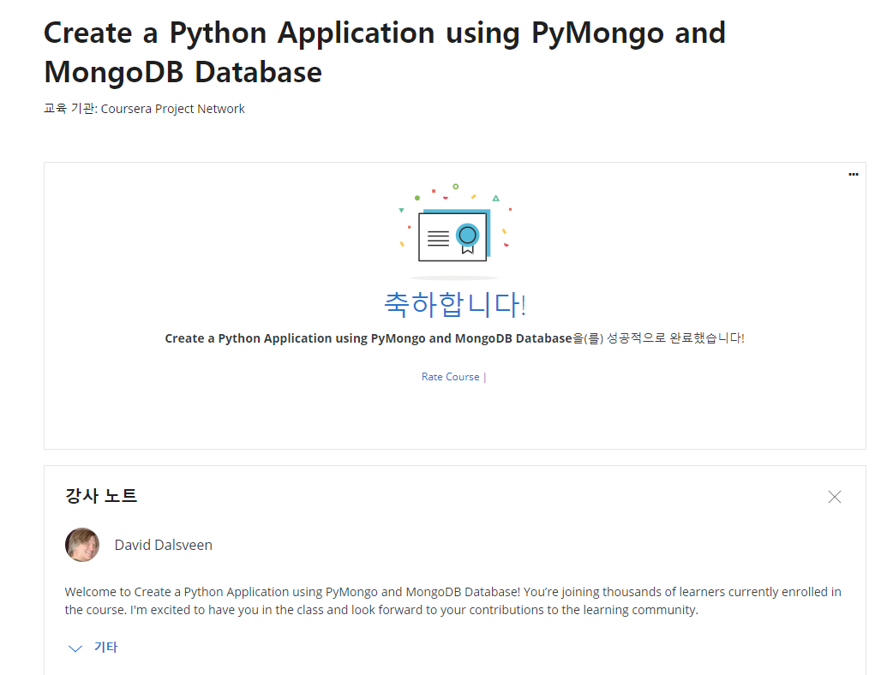

# pymongo

mongodb에 있는 데이터를 python을 이용하여 제어하기 위해 pymongo에 대해 공부한다.  

​    

- [pymongo_tutorial](https://github.com/musicjae/pymongo/tree/main/pymongo_tutorial)  
  - Reference [1],[2] 참고  

- [Create a Python Application using PyMongo and MongoDB Database in Coursera](https://github.com/musicjae/pymongo/tree/main/Coursera_python%20and%20MongoDB%20with%20pymango)  
  - Reference [3] 참고 및 발췌  
  

### Reference  

[1] http://zetcode.com/python/pymongo/  

[2] https://www.youtube.com/watch?v=YbLzV90dksE  

[3] https://www.coursera.org/learn/python-application-pymango-mongodb-database/home/welcome
